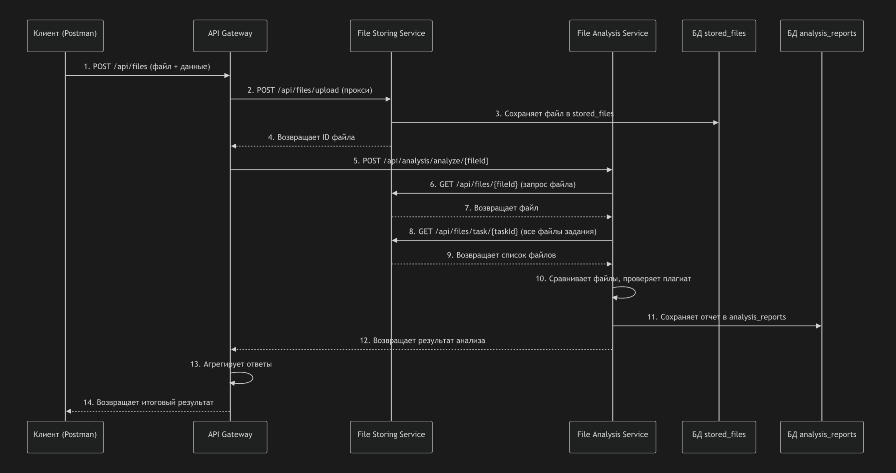

# Antiplagiat
## Система антиплагиата для проверки студенческих работ

Микросервисная система для автоматической проверки студенческих работ на плагиат с генерацией отчетов.
##  Архитектура системы

Система построена на микросервисной архитектуре с использованием Spring Boot и состоит из трех независимых сервисов:
### 1. **API Gateway** (`порт 9080`)
- Единая точка входа для всех клиентских запросов
- Маршрутизация к соответствующим сервисам
- Сбор ответов от нескольких сервисов
- Health check всех компонентов системы
### 2. **File Storing Service** (`порт 9081`)
- Хранение текстовых файлов студентов
- Управление метаданными файлов (имя, студент, задание)
- Поиск файлов по различным критериям
- **База данных:** `stored_files`
#### Структура таблицы `stored_files`:
| Поле | Тип | Описание |
|------|-----|----------|
| id | BIGINT | Уникальный идентификатор |
| file_name | VARCHAR(255) | Имя файла |
| student_name | VARCHAR(255) | ФИО студента |
| task_id | INTEGER | Номер задания |
| file_content | TEXT | Содержимое файла |
| upload_date | TIMESTAMP | Дата загрузки |
### 3. **File Analysis Service** (`порт 9082`)
- Анализ файлов на плагиат
- Генерация отчетов по проверке
- **База данных:** `analysis_reports`
#### Структура таблицы `analysis_reports`:
| Поле | Тип | Описание |
|------|-----|----------|
| id | BIGINT | Уникальный идентификатор |
| file_id | BIGINT | Ссылка на файл |
| task_id | INTEGER | Номер задания |
| student_name | VARCHAR(255) | ФИО студента |
| is_plagiarism | BOOLEAN | Флаг плагиата |
| plagiarism_source | TEXT | Источник плагиата |
| analysis_date | TIMESTAMP | Дата анализа |
##  Пользовательские сценарии

### Сценарий 1: Загрузка и проверка работы студента
1. **Студент** загружает файл с решением 
2. **Система** сохраняет файл 
3. **Преподаватель** запускает проверку на плагиат
4**Преподаватель** просматривает отчет о проверке

### Сценарий 2: Анализ задания со списком работ
1. **Преподаватель** запрашивает сводный отчет по заданию
2. **Система** показывает список всех работ с отметками о плагиате

### Сценарий 3: Мониторинг системы
1. **Администратор** проверяет состояние всех сервисов
2. **Система** показывает статус каждого микросервиса
3. **Администратор** получает уведомления о проблемах
##  Технические сценарии взаимодействия

### Сценарий A: Полная загрузка и анализ файла
1. Клиент → POST /api/files (Gateway:9080)

2. Gateway → POST /api/files/upload (File Storing:8081)
   - Сохраняет файл в БД, возвращает file_id
3. Gateway → POST /api/analysis/analyze/{file_id} (Analysis:8082)

4. Analysis Service → GET /api/files/{file_id} (File Storing)
   -  Получает содержимое файла

5. Analysis Service → GET /api/files/task/{task_id} (File Storing)
    - Получает все файлы по заданию
6. Analysis Service сравнивает файлы, определяет плагиат
   -  Сохраняет результат в свою БД
7. Gateway агрегирует ответы → возвращает клиенту
### Сценарий B: Получение отчета по заданию
1. Клиент → GET /api/files/{task_id}/report (Gateway:9080)
2. Gateway → GET /api/analysis/reports/task/{task_id} (Analysis:8082)
3. Analysis Service запрашивает данные из своей БД
   -  Формирует сводный отчет
4. Gateway возвращает отчет клиенту
##  Инструкция по запуску проекта
`docker-compose build --no-cache` -> пересборка образов

`docker-compose up ` -> запуск контейнеров
##  Тестирование (Antiplagiat.postman_collection.json)
- Запрос 1: API Gateway Health -> http://localhost:9080/api/health
- Запрос 2: File Storing Health -> http://localhost:9081/api/files/health
- Запрос 3: File Analysis Health -> http://localhost:9082/api/analysis/health
- Запрос 4: Upload File -> http://localhost:9081/api/files/upload
- Запрос 5: Get All Files -> http://localhost:9081/api/files/all
- Запрос 6: Get Files by Task -> http://localhost:9081/api/files/task/1
- Запрос 7: Analyze File -> http://localhost:9082/api/analysis/analyze/1
- Запрос 8: Get Reports -> http://localhost:9082/api/analysis/reports
- Запрос 9: Get Task Reports -> http://localhost:9082/api/analysis/reports/task/1
- Запрос 10: Upload via Gateway -> http://localhost:9080/api/files
- Запрос 11: Get Report via Gateway -> http://localhost:9080/api/files/1/report
##  Приложение
